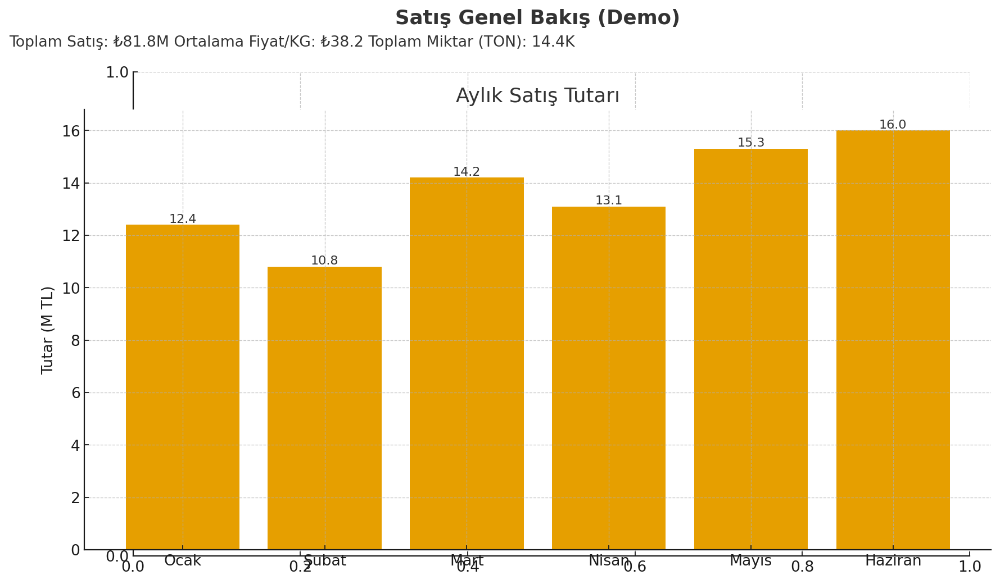
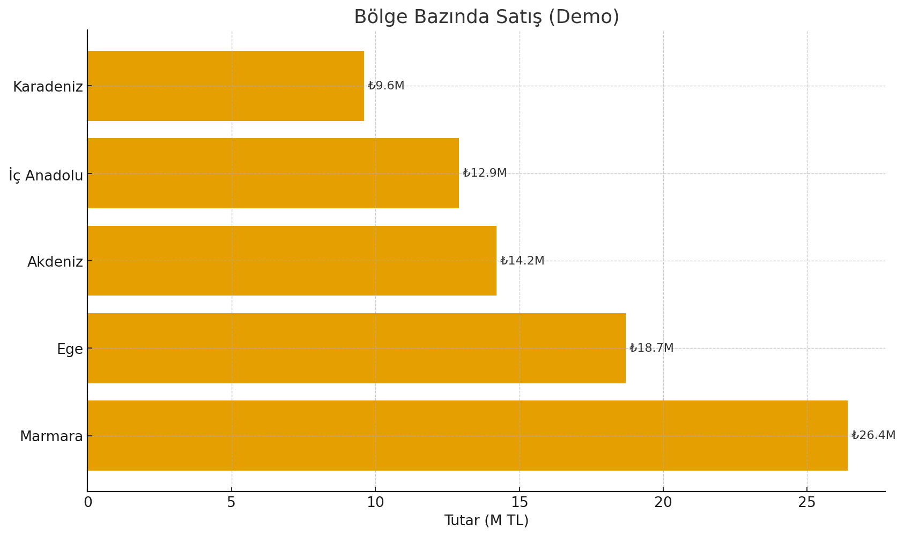
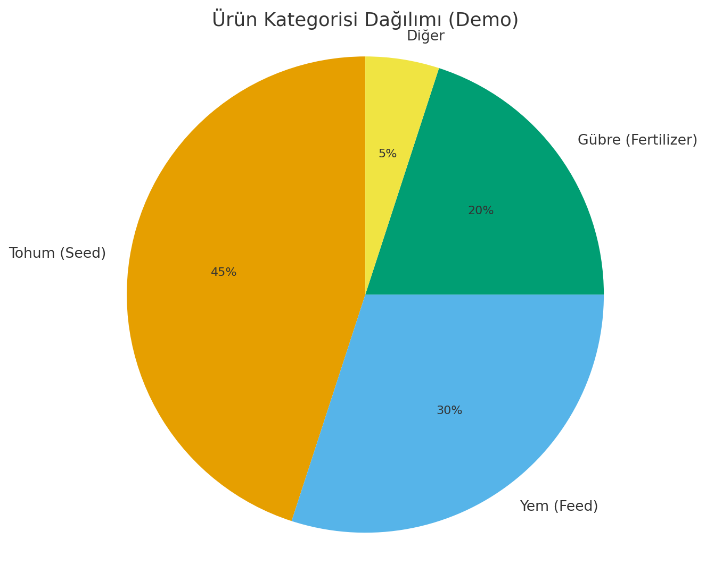

# bi-hybrid-portfolio
Hybrid Business Intelligence &amp; Backend Engineering Portfolio   Qlik Sense • SQL • ETL • Data Modeling • .NET Web API
## 📊 Dashboard Examples (Demo)

> Sample dashboards created with synthetic data for BI portfolio.

### Sales Overview

### Sales by Region

### Product Share

## 🧭 Quick Links
- Dataset → [/dataset/sales_data.csv](dataset/sales_data.csv)
- KPI SQL → [/sql/reporting_kpi_queries.sql](sql/reporting_kpi_queries.sql)
- ETL (Incremental) → [/sql/etl_incremental_load.sql](sql/etl_incremental_load.sql)
- Data Model → [/docs/data_model.md](docs/data_model.md)
- Demo API → [/api/Program.cs](api/Program.cs)

## 📂 Repository Structure
dataset/                         # Dummy CSV
sql/                             # ETL & reporting SQL
docs/                            # KPI definitions, data model
dashboards/dummy_screenshots/    # Demo dashboard görselleri
api/                             # Minimal .NET API (in-memory)

## 📊 Real-World BI Projects

### 🔹 Sales Performance Dashboard (Qlik Sense)
**Role:** BI Developer  
**Tech:** Qlik Sense, SQL, ETL, Data Modeling  
- Bölge / ürün / kanal bazlı satış raporu  
- Dinamik tarih seçimi ve KPI kartları  
- Net satış, brüt maliyet, brüt kar analizi  
- Year-over-Year karşılaştırma  
- Bookmark ve Section Access yönetimi  

> Demo versiyonu: `dashboards/dummy_screenshots/`

---

### 🔹 Production Monitoring Dashboard (Qlik Sense)
**Role:** BI Developer  
**Tech:** Qlik Sense, SQL, Incremental Load  
- Fabrika bazlı üretim ölçümü  
- Günlük & aylık üretim KPI’ları  
- Ürün grubu dashboard’ları  
- Alarm & anomaly kontrol görünümleri  

---

### 🔹 ETL & Data Warehouse (SQL Server)
**Role:** Data Engineer  
**Tech:** SQL, Stored Procedures, Views, Incremental ETL  
- Raw → Staging → DWH modelleme  
- Incremental load script geliştirme  
- Calendar & dimension table yönetimi  
- Performans optimizasyonu
