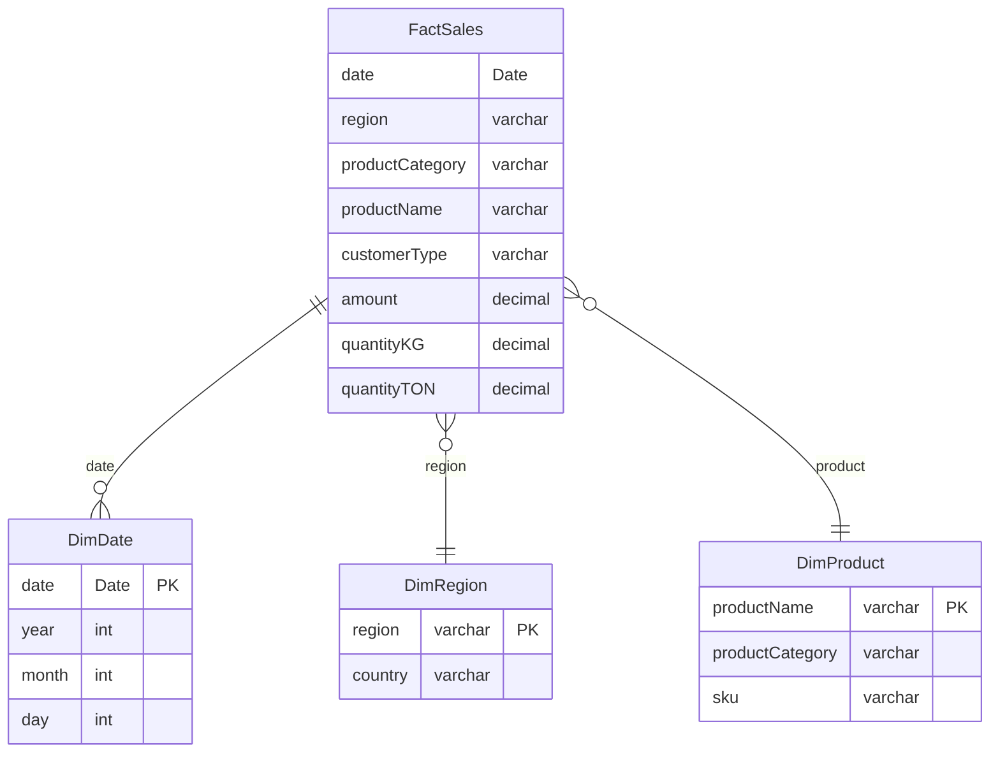

# Data Model (Star Schema)

Below is the logical star-schema design for the demo sales dataset.

```mermaid
erDiagram
  FactSales {
    date Date
    region varchar
    productCategory varchar
    productName varchar
    customerType varchar
    amount decimal
    quantityKG decimal
    quantityTON decimal
  }

  DimDate {
    date Date PK
    year int
    month int
    day int
  }

  DimRegion {
    region varchar PK
    country varchar
  }

  DimProduct {
    productName varchar PK
    productCategory varchar
    sku varchar
  }

  FactSales ||--o{ DimDate : "date"
  FactSales }o--|| DimRegion : "region"
  FactSales }o--|| DimProduct : "product"
```
